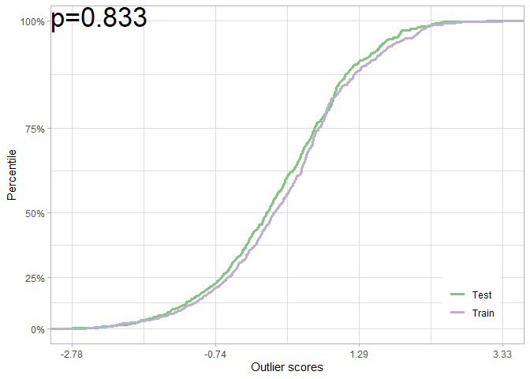
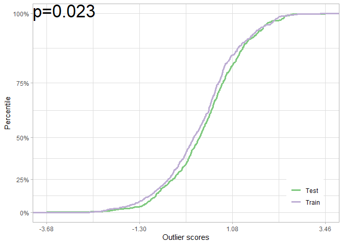
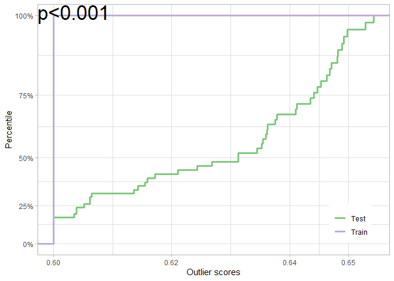

# `D-SOS`: Dataset shift with outlier scores

<!-- README.md is generated from README.Rmd. Please edit that file -->
<!-- badges: start -->

[](https://www.tidyverse.org/lifecycle)
[](https://www.gnu.org/licenses/gpl-3.0.en.html)
[](https://cran.r-project.org/package=dsos)
[](https://openreview.net/forum?id=S5UG2BLi9xc)
[](https://cran.r-project.org/package=dsos)
[](https://youtu.be/TALE9JUir8Q?t=26)
<!-- badges: end -->

## Overview

`dsos` tests for no adverse shift based on outlier scores. Colloquially,
these tests check whether the new sample is not substantively worse than
the old sample, not if the two are equal as tests of equal distributions
do. `dsos` implements a family of two-sample comparison which assumes
that we have both a training set, the reference distribution, and a test
set.

## Installation

The package is under active development. From GitHub (which includes
recent improvements), install with:

``` r
# install.packages("remotes")
remotes::install_github("vathymut/dsos")
```

The package is also on [CRAN](https://CRAN.R-project.org), although the
CRAN release may lag behind GitHub updates. From CRAN, install the
package with:

``` r
install.packages("dsos")
```

## Quick Start

Simulate outlier scores to test for no adverse shift when the null (no
difference) holds. First, we use the permutation test:

``` r
library(dsos)
set.seed(12345)
n <- 6e2
os_train <- rnorm(n=n)
os_test <- rnorm(n=n)
null_pt <- pt_from_os(os_train, os_test)
plot(null_pt)
```



We can also use the (faster) asymptotic test:

``` r
null_at <- at_from_os(os_train, os_test)
plot(null_at)
```

 In both
cases, we fail to reject the null of no adverse shift.

We can repeat this exercise when there is an adverse shift. Again, with
the permutation test:

``` r
os_shift <- rnorm(n = n, mean = 0.2)
shift_pt <- pt_from_os(os_train, os_shift)
plot(shift_pt)
```


Once more, with the asymptotic test:

``` r
shift_at <- at_from_os(os_train, os_shift)
plot(shift_at)
```

 We would
reject the null of no adverse shift in both cases: the test set is worse
off when compared to the reference (training) scores.

## Custom scoring functions

We can use `dsos` to test for adverse shift on the
[`iris`](https://en.wikipedia.org/wiki/Iris_flower_data_set) dataset.
Here, the outlier scores are from isolation forest for density-based
out-of-distribution (OOD) detection:

``` r
data(iris)
versicolor <- iris[51:100, 1:4] # Training sample: Species == 'versicolor'
virginica <- iris[101:150, 1:4] # Test sample: Species == 'virginica'
iris_test <- pt_refit(x_train = versicolor, x_test = virginica, scorer = score_od)
plot(iris_test)
```



`dsos` also implements a method for confidence-based OOD detection via
prediction uncertainty. Users can easily plug in their own scores via
the scoring function.

## Reference

To cite this work and for technical details, please refer to the
[paper](https://openreview.net/forum?id=S5UG2BLi9xc). Sample Bibtex is
given below:

``` bibtex
@inproceedings{kamulete2022test,
  title     = {Test for non-negligible adverse shifts},
  author    = {Vathy M. Kamulete},
  booktitle = {The 38th Conference on Uncertainty in Artificial Intelligence},
  year      = {2022},
  url       = {https://openreview.net/forum?id=S5UG2BLi9xc}
}
```

I gave a talk introducing the `dsos` R package at [useR!
2022](https://youtu.be/TALE9JUir8Q?t=26) during the ‘Unique Applications
and Methods’ track. It is a 15-minute crash course, focused on
motivation and interpretation.

## Future work 🚧

Upcoming in future releases (work in progress) of the package:

-   Testing for no adverse shift via Bayes factor (the Bayesian
    approach).
