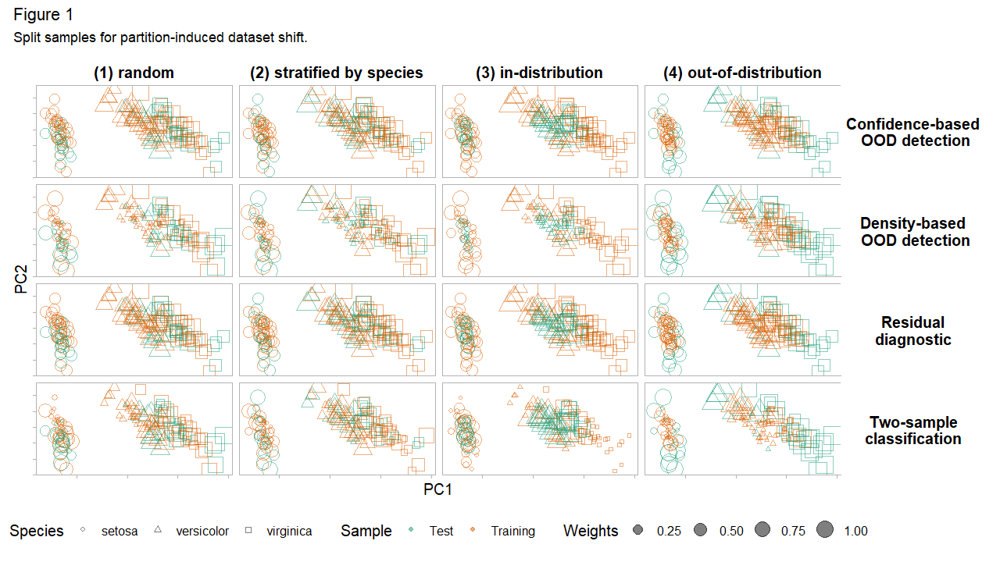
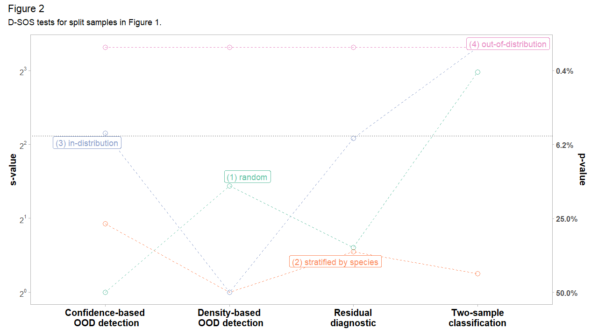

```{r setup, include = FALSE}
knitr::opts_chunk$set(
  collapse = TRUE,
  comment = "#>"
)

library("dsos")
```

Note that this vignette is adapted from the
[arXiv paper](https://arxiv.org/abs/2107.02990)

## Background

Suppose we fit a predictive model on a training set and predict on a test set.
Dataset shift [@quionero2009dataset; @moreno2012unifying; @kelly1999impact],
also known as data or population drift,
occurs when training and test distributions are not alike. This is essentially
a sample mismatch problem. Some regions of the data space are either too
sparse or absent during training and gain importance at test time. We want
methods to alert us to the presence of unexpected inputs in the test set
[@rabanser2019failing]. To do so, a measure of divergence between training
and test set is required. Can we not simply use the many modern off-the-shelf
multivariate tests of equal distributions for this?

One reason for moving beyond tests of equal distributions is that they are
often too strict. They require high fidelity between training and test set
everywhere in the input domain. However, not *all* changes in distribution are
a cause for concern -- some changes are benign. Practitioners distrust these
tests because of false alarms. @polyzotis2019data comment:

> statistical tests for detecting changes in the data distribution [...] are too
> sensitive and also uninformative for the typical scale of data in machine learning
> pipelines, which led us to seek alternative methods to quantify changes between
> data distributions.

Even when the difference is small or negligible, tests of equal distributions
reject the null hypothesis of no difference. An alarm should only be raised if
a shift warrants intervention. Retraining models when distribution changes are
benign is both costly and ineffective. To tackle these challenges, we propose
`D-SOS` instead. Monitoring model performance and data quality is a critical
part of deploying safe and mature models in production and `D-SOS`
provides robust and actionable tests for this [@paleyes2020challenges;
@klaise2020monitoring; @sculley2014machine; @breck2017ml].

In comparing the test set to the training set, `D-SOS` pays more attention to
the regions –- typically, the outlying regions –- where we are most vulnerable.
To confront false alarms, it uses a robust test statistic, namely the
weighted area under the receiver operating characteristic curve (WAUC). The
weights in the WAUC [@li2010weighted] discount the safe regions of the
distribution. To the best of our knowledge, this is the first time that the
WAUC is being used as a test statistic in this context. The goal of `D-SOS` is
to detect *non-negligible adverse shifts*. This is reminiscent of noninferiority
tests [@wellek2010testing], widely used in healthcare to determine if a new
treatment is in fact not inferior to an older one. Colloquially, the `D-SOS`
null hypothesis holds that the new sample is not substantively worse than the
old sample, and not that the two are equal.

`D-SOS` moves beyond tests of equal distributions and lets users specify which
notions of outlyingness to probe. The choice of the score function plays a
central role in formalizing what we mean by *worse*. The scores can come from
out-of-distribution detection, two-sample classification, uncertainty
quantification, residual diagnostics, density estimation, dimension reduction,
and more. While some of these scores are underused and underappreciated in
two-sample tests, they are valid and can be more informative in some cases.
The main takeaway is that given a generic method that assigns an outlier score
to a data point, `D-SOS` uplifts these scores and turns them into a
two-sample test for no adverse shift.

## Motivational example

For illustration, we apply `D-SOS` to the canonical `iris` dataset
[@anderson1935irises]. The task is to classify the species of Iris flowers
based on $d=4$ covariates (features) and $n=50$ observations for each
species. The first two principal components of `iris` show that these species
cluster together. We show how `D-SOS` helps diagnose false alarms. We highlight
that (1) changes in distribution do not necessarily hurt predictive performance,
and (2) points in the densest regions of the distribution can be the most
difficult -- unsafe -- to predict.

For the subsequent tests, we split `iris` into 2/3 training and 1/3 test set.
Figure 1 displays these train-test pairs, split according to
four partitioning strategies. These splits correspond to (1) random sampling,
(2) stratified sampling by species, (3) in-distribution (most dense) examples
in the test set, and (4) out-of-distribution (least dense) examples in the test
set. Looking down each column in Figure 1 shows the same split
for different `D-SOS` tests. The shape and color of each point map to the
species and whether it is assigned to the training or test set and its size
is proportional to its importance in a given test.

```{r pca-random, echo=FALSE, out.height="100%", out.width="100%"}

```

We consider four `D-SOS` tests of no adverse shift. The outlier score for each
test determines its type. For two-sample classification, define this score
as the probability of belonging to the test set. For density-based
out-of-distribution (OOD) detection, the score is the isolation score, which
is (roughly) inversely related to the local density. For residual diagnostics,
it is the out-of-sample (out-of-bag) prediction error from random forests.
Finally, for confidence-based OOD detection (prediction uncertainty), it is the
standard error of the mean prediction. Only the first notion of
outlyingness -- two-sample classification -- pertains to modern tests of equal
distributions; the others capture other meaningful notions of adverse shifts.
For all these scores, higher is *worse*: higher scores indicate that the
observation is diverging from the desired outcome or that it does not conform
to the training set. Looking across each row in Figure 1 shows the same `D-SOS`
test for different sample splits.

How do the sample splits in Figure 1 fare with respect to
these `D-SOS` tests? Let $s$ and $p$ denote $s-$value and $p-$value. The
results are reported on the $s = -\, \log_{2}(p)$ scale because it is
intuitive and lends itself to comparison. An $s-$value of $k$ can be interpreted
as seeing $k$ independent coin flips with the same outcome -- all heads or
all tails -- if the null is that the coin is *fair* [@greenland2019valid]. This
conveys how incompatible the data is with the null hypothesis. For plotting, we
winsorize (clip) $s-$values to a low and high of 1 and 10 respectively. We
also display a secondary y-axis with the $p-$value as a cognitive bridge.

In Figure 2, the case with (1) random sampling exemplifies
the type of false alarms we want to avoid. Two-sample classification, standing
in for tests of equal distributions, is incompatible with the null of no adverse
shift (a $s-$value of around 8). But this shift does not carry over to the
other tests. Residual diagnostics, density-based and confidence-based OOD
detection are all fairly compatible with the view that the test set is not worse.
Had we been entirely reliant on two-sample classification, we may not have
realized that this shift is essentially benign. Tests of equal distributions
alone give a narrow perspective on dataset shift. Contrast (1) random
with (2) stratified sampling. When stratified by species, all the tests are
compatible with the null of no adverse shift.

```{r dsos-outlier, echo=FALSE, out.height="100%", out.width="100%"}

```

We expect the density-based OOD detection to waive the (3) in-distribution test
set and flag the (4) out-of-distribution one. Indeed, the results in Figure
2 concur. We might be tempted to conclude that the
in-distribution observations are *safe*, and yet, the tests based on residual
diagnostics and confidence-based OOD detection (prediction uncertainty) are
fairly incompatible with this view. This is because some of the in-distribution
(densest) points are concentrated in a region where the classifier does not
discriminate well: the species 'versicolor' and 'virginica' overlap to some
degree. That is, the densest observations are not necessarily safe.
Density-based OOD detection glosses over this. The trouble may very well come
from the in-distribution points. `D-SOS` offers a more holistic
perspective of dataset shift because it borrows strength from these
complementary notions of outlyingness.

The point of this exercise is twofold. First, we stress the limits of
tests of equal distributions when testing for dataset shift. They are
unable, by definition, to detect whether the shift is benign or not.
Second, we propose a family of tests based on outlier scores, `D-SOS`,
which offers a more holistic view of dataset shift. `D-SOS`
is flexible and can be easily extended to test for other modern notions of
outlyingness such as trust scores [@jiang2018trust]. We hope this
encourages more people to test for *adverse* shifts.

## References
